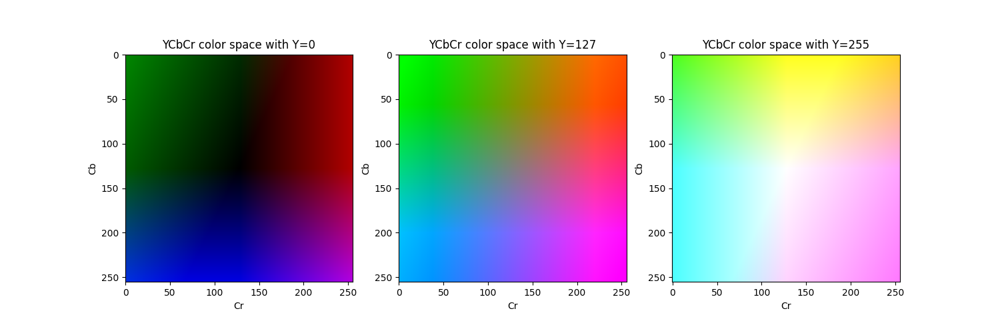
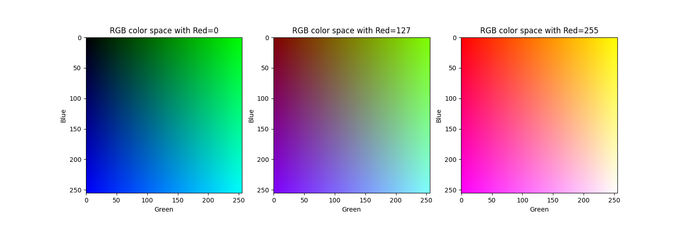

# Color Space Visualization

This script provides a visualization of color spaces using Python and matplotlib. It's particularly focused on the YCbCr and RGB color spaces. YCbCr is widely used in image and video processing algorithms, especially for image analytics. RGB is very common for creating visualizations.



In the graph it can be seen how the Cb-axis controls the blue shift. The color goes from not blue to blue. The Cr-axis controls the red shift. The color goes from not red to red. In the very center of the graphs we always have the gray scale values.



In the graph it can be seen how each of the three dimensions controls a color. This means that there is no fixed location in the graph where the gray scale values are located, they are instead found where all the three axes have the same value (i.e. top left in first image, center in second image and bottom right in the third image).

## YCbCr Color Space

The YCbCr color space separates an image into luminance (Y) and chrominance (Cb and Cr) components. This separation is useful because it better relates to how humans think about visuals: brightness (luminance) and color (chrominance). This makes it easier to e.g., analyze the color of an object while ignoring different levels of brightness.

The color space is also useful in compression since humans are more sensitive to brightness than to color. Therefore it often makes sense to compress the chrominance more than the luminance.

Due to these two reasons, network cameras and other IoT devices, often use the YCbCr color space instead of the RGB color space.

### YCbCr Visualization

The [ycbcr.py](ycbcr.py) script can be used to create a single plot with the Cb-Cr plane for a single luminance value, or a plot with multiple planes. The script will show a view with the result and can optionally save the result to an image file with the `--save-to` argument.

Create a single plot with luminance 200:
```bash
python ycbcr.py single --luminance 200
```

Create 5 plots with luminance from 0 to 255:
```bash
python ycbcr.py multiple --steps 5
```

## RGB Color Space
The RGB color space is an additive color model in which the red, green, and blue primary colors of light are added together in various ways to reproduce a broad array of colors.

The RGB color model is an integral part of digital color representation. It's used extensively in digital imaging and graphics because it's supported by a wide range of hardware and software, and because it's intuitively understood as the effect of controlling three independent light sources with the three base colors.

### RGB Visualization
See the section [YCbCr Visualization](#ycbcr-color-space), the options are the same but the script is named [rgb.py](rgb.py).